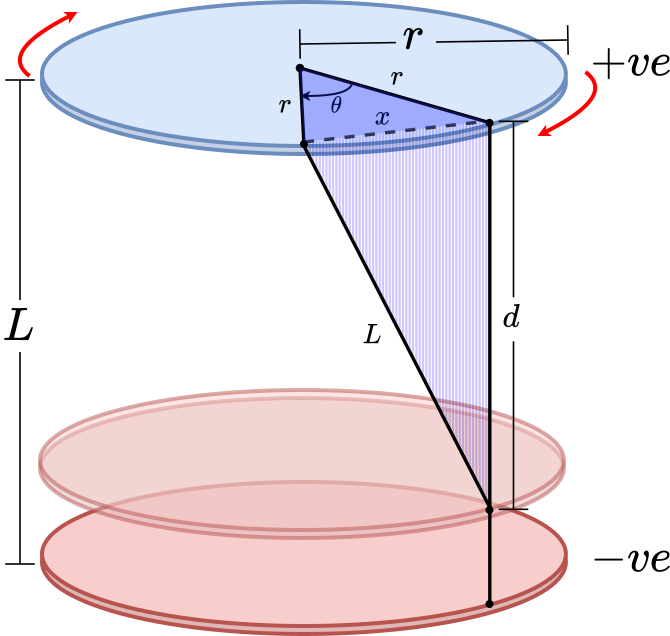
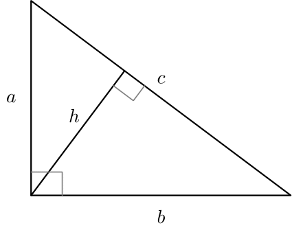

# Editorial for IUT Intra-University Programming Contest 2025

<details>
<summary>Problem A - Pacman vs. Vampire</summary>

Problem Setter: [Irfanur Rahman Rafio](https://codeforces.com/profile/Rafio)  
Estimated Difficulty: 1500  
Tag(s): Graph

<details>
<summary> Hint 1</summary>

The vampires know Pacman's moves.

</details>

<details>
<summary> Hint 2</summary>

Pacman should exit as soon as possible.

</details>

<details>
<summary> Hint 3</summary>

Find a way to count how many vampires can bite Pacman.

</details>

<details>
<summary> Hint 4</summary>

This problem has a crazy edge case.

</details>

<details>
<summary> Hint 5</summary>

What is the role of walls in this problem?

</details>

<details>
<summary>Solution</summary>

Since the vampires know Pacman's initial location and all moves (thus, the full path), there is no point for Pacman in trying to evade them. So Pacman's optimal strategy is to exit the game as soon as possible.

Each vampire is independent and can bite Pacman at most once. To bite Pacman, a vampire needs to occupy the same cell as Pacman at some point before Pacman exits the game. Now, consider the set of possible meeting points: the food cell (the cell containing the food), Pacman's position just before the food, the one before that, and so on, up to Pacman's starting cell.

If a vampire can meet Pacman at an earlier cell, then by following the same moves as Pacman, it can also meet Pacman at the food cell. The contrapositive is also true: if a vampire cannot reach the food cell in time, then it cannot meet Pacman at any earlier cell either. Therefore, the question "Can a vampire meet Pacman before it exits?" is equivalent to the simpler question "Can a vampire reach the food cell in time?"

This observation reduces the problem to comparing distances. Since both Pacman and the vampires move one cell per turn, a vampire can bite Pacman if and only if its distance to the food cell is less than or equal to Pacman's distance to the food cell.

To check this efficiently, you can run a BFS from the food cell. This gives the distance from the food to every other cell in the grid. Let $dP = \text{distance from Pacman's starting cell to the food}$ and $dV_i = \text{distance from the starting cell of the } i\text{-th vampire to the food}$. The $i$-th vampire can successfully bite Pacman if and only if $dV_i \le dP$.

Finally, Pacman always gains $+500$ points for eating the food, and loses $10$ points for each vampire that manages to bite. Let the number of vampires that can bite Pacman be $B$. The optimal score is: $500 - 10B$.

The following is a compact formulation of the inference:  
Optimal Score $= 500 - 10 \times |\\{ \text{Vampires that can bite Pacman in an optimal play} \\} |$  
 $= 500 - 10 \times |\\{ \text{Vampires that can meet Pacman before he exits} \\} |$  
 $= 500 - 10 \times |\\{ \text{Vampires that can meet Pacman at the food cell} \\} |$  
 $= 500 - 10 \times |\\{ \text{Vampires that can reach the food cell before Pacman or on the same turn} \\} |$  
 $= 500 - 10 \times |\\{ i : dV_i \le dP \\} |$

---

However, this is an **evil problem**. Every statement written till now had a hidden assumption: Pacman can reach the food and exit the game.  
However, because of the walls, this may not be true. It is possible that Pacman and the food are in separate components. In that scenario, all the vampires that are in the same component as Pacman can bite Pacman as the game won't end untill $10^7$ turns. The optimal score will then be: $-10B$.  
To find $B$, you can run DFS/BFS from Pacman's initial cell and count how many vampires are in the same component.

Time Complexity = $\mathcal{O}(nm)$

<details>

<summary>Code</summary>

```cpp
#include <bits/stdc++.h>
using namespace std;

#define fastio ios_base::sync_with_stdio(0); cin.tie(0)
using LL = long long;
using PII = pair<int,int>;

LL inf = 1e7 + 5;


void addNode(int x, int y, int d, vector<string>& grid, vector<vector<int>>& dist, queue<PII>& q)
{
    if(x < 0) return;
    if(y < 0) return;

    int n = grid.size(), m = grid[0].size();
    if(x >= n) return;
    if(y >= m) return;

    if(grid[x][y] == '#') return;
    if(dist[x][y] <= d) return;

    q.push({x, y});
    dist[x][y] = d;
}

void bfs(vector<string>& grid, vector<vector<int>>& dist, int sx, int sy)
{
    queue<PII> q;
    addNode(sx, sy, 0, grid, dist, q);

    while(!q.empty())
    {
        auto [x, y] = q.front();
        q.pop();

        auto d = dist[x][y];

        addNode(x - 1, y, d + 1, grid, dist, q);
        addNode(x + 1, y, d + 1, grid, dist, q);
        addNode(x, y - 1, d + 1, grid, dist, q);
        addNode(x, y + 1, d + 1, grid, dist, q);
    }
}


void pre()
{
    fastio;


}

void solve(int tc)
{
    int i, j, n, m, v = 0;
    cin >> n >> m;

    vector<string> grid(n);
    vector<vector<int>> dist(n, vector<int>(m, inf));
    for(auto &row: grid) cin >> row;

    int px, py, fx, fy;
    for(i = 0; i < n; i++) for(j = 0; j < m; j++)
    {
        if(grid[i][j] == 'P') px = i, py = j;
        if(grid[i][j] == 'F') fx = i, fy = j;
    }

    bfs(grid, dist, fx, fy);

    if(dist[px][py] == inf)
    {
        for(i = 0; i < n; i++)
            for(j = 0; j < m; j++)
                dist[i][j] = inf;

        bfs(grid, dist, px, py);

        for(i = 0; i < n; i++)
            for(j = 0; j < m; j++)
                if(grid[i][j] == 'V' and dist[i][j] < inf)
                    v++;

        cout << -10 * v;
        return;
    }

    for(i = 0; i < n; i++)
        for(j = 0; j < m; j++)
            if(grid[i][j] == 'V' and dist[i][j] <= dist[px][py])
                v++;

    cout << 500 - 10 * v;
}

int main()
{
    pre();

    int tc, tt = 1;
    cin >> tt;

    for(tc = 1; tc <= tt; tc++)
    {
        // cout << "Case " << tc << ": ";
        solve(tc);
        cout << '\n';
    }

    return 0;
}
```

</details>
</details>
</details>

<details>
<summary>Problem B - Roman Empire</summary>

Problem Setter: [Abdullah Abrar](https://codeforces.com/profile/lelbaba)  
Estimated Difficulty: 900  
Tag(s): Implementation

<details>
<summary>Solution</summary>

To convert a number to a Roman numeral, you first need to understand the structure. The key is that Roman numerals, much like the natural number system, are based on **postional value**.  
If you take a number like $1248$, you think of it as $1000 + 200 + 40 + 8$. The Roman numeral system treats it the same way. The representation for $1000$ is M, for $200$ is CC, for $40$ is XL, and for $8$ is VIII. To get the final Roman numeral, you simply join these parts together: MCCXLVIII.

Each digit in a number corresponds to a specific Roman numeral substring. This substring for the digit depends just on its value and position. The final result is always the **concatenation** of these substrings, from the largest postional value to the smallest.

Interestingly, the **pattern** for forming the numeral for any digit from 1 to 9 is universal. It just uses a different set of symbols depending on the positional value. For any given position (ones, tens, hundreds), you can identify a "one" symbol (I, X, C), a "five" symbol (V, L, D), and the "next one" symbol (X, C, M).

You can process the input number one digit at a time, from left to right (thousands, then hundreds, and so on). The core of this process is a reusable function that can convert any single digit from 0-9 into its Roman numeral substring, given its postional value.

The logic for converting a single digit can be broken down into three distinct types of cases.

1. **The Subtractive Cases**: Digits 4 and 9 are special. They are formed by placing a "one" symbol to represent subtraction.

2. **The Additive Cases**: Digits 1, 2, and 3 are the simplest. They are formed by repeating the "one" symbol for that postional value one, two, or three times (e.g., III or XXX).

3. **The Additive Cases with Five**: Digits 5, 6, 7, and 8 all start with the "five" symbol. The number 5 is just the "five" symbol itself. For 6, 7, and 8, you start with the "five" symbol and then append the Roman numeral for the remainder (1, 2, or 3).

This algorithm can be cleanly implemented using recursion.

<details>
<summary>Code</summary>

```cpp
#include <bits/stdc++.h>
using namespace std;

#define fastio ios_base::sync_with_stdio(0); cin.tie(0)
using LL = long long;

string symbols[] = {"I", "V", "X", "L", "C", "D", "M", ""};

string getSymbol(int digit, int pos)
{
    string one = symbols[pos * 2], five = symbols[pos * 2 + 1];

    if(digit == 0) return "";
    if(digit == 9) return one + getSymbol(1, pos + 1);
    if(digit >= 5) return five + getSymbol(digit - 5, pos);
    if(digit == 4) return one + five;
    return one + getSymbol(digit - 1, pos);
}


void pre()
{
    fastio;


}

void solve(int tc)
{
    int n;
    cin >> n;

    cout << getSymbol(n / 1000, 3); n %= 1000;
    cout << getSymbol(n / 100, 2); n %= 100;
    cout << getSymbol(n / 10, 1); n %= 10;
    cout << getSymbol(n, 0);
}

int main()
{
    pre();

    int tc, tt = 1;
    cin >> tt;

    for(tc = 1; tc <= tt; tc++)
    {
        // cout << "Case " << tc << ": ";
        solve(tc);
        cout << '\n';
    }

    return 0;
}
```

</details>
</details>

<details>
<summary>Alternate Solution</summary>

A great alternative strategy for this problem is to use a precomputed **lookup table**. Instead of building the logic to figure out Roman numerals on the fly, you do the work ahead of time and store all the possible answers in a simple table. Since $n \le 1316$, you only need to work with at most $4$ digits.

With your lookup table ready, the algorithm to convert a number becomes very straightforward. You can write a simple loop that processes the input number from the highest place value down to the lowest.

The primary advantage of this method is its _simplicity_ and _reliability_. The program at runtime isn't 'thinking' about Roman numeral rules; it's just retrieving an answer that you've already prepared. Your runtime code becomes incredibly clean - just a loop and an array lookup. This makes your code far less prone to bugs compared to a recursive function or a complex series of if-else statements.

<details>
<summary>Code</summary>

```cpp
#include <bits/stdc++.h>
using namespace std;

#define fastio ios_base::sync_with_stdio(0); cin.tie(0)
using LL = long long;

string digit[4][10] = {
    {"", "I", "II", "III", "IV", "V", "VI", "VII", "VIII", "IX"},
    {"", "X", "XX", "XXX", "XL", "L", "LX", "LXX", "LXXX", "XC"},
    {"", "C", "CC", "CCC", "CD", "D", "DC", "DCC", "DCCC", "CM"},
    {"", "M", "MM", "MMM", "", "", "", "", "", ""}
};

int p10[4] = {1, 10, 100, 1000};


void pre()
{
    fastio;


}

void solve(int tc)
{
    int i, n, d;
    cin >> n;

    for(i = 3; i >= 0; i--)
    {
        d = (n / p10[i]) % 10;
        cout << digit[i][d];
    }
}

int main()
{
    pre();

    int tc, tt = 1;
    cin >> tt;

    for(tc = 1; tc <= tt; tc++)
    {
        // cout << "Case " << tc << ": ";
        solve(tc);
        cout << '\n';
    }

    return 0;
}
```

</details>
</details>

<details>
<summary>Bonus Problem</summary>

Try to solve the reverse problem. Given a roman numeral representation of a number, determine its value.

</details>
</details>

<details>
<summary>Problem C - Cursed Queries</summary>

Problem Setter: [Nayeem Hossain Ahad](https://codeforces.com/profile/flying_saucer)  
Estimated Difficulty: 1900  
Tag(s): Data Structures, Range Query, Number Theory

<details>
<summary>Hint 1</summary>

Try to relate it with gcd.

</details>
<details>
<summary>Hint 2</summary>

$m$ is fixed for any testcase.

</details>

<details>
<summary>Hint 3</summary>

Highest number of divisors of $m$ is $48$.

</details>

<details>
<summary>Solution</summary>

Let's try to determine for any value of $k$ which number $a$ will be `k-good`.

Formally, you can write $a$ will be `k-good` if  
$a + kx \equiv 0 \pmod{m}$ is unsolvable.

Rewriting the equation you get:  
$a + kx = my \quad , \quad (\ x,\ y \in \mathbb{Z} ,\ x > 0,\ y > 0)$  
$\Rightarrow my - kx = a$ 

---

**Case 1: When a is not divisible by gcd(m, k).**

Let,  
$g = \gcd(m, k), \quad m' = \frac{m}{g}, \quad k' = \frac{k}{g}$ 

$my - kx = a$  
$\Rightarrow g m' y - g k' x = a$ 

This equation will be solvable for integer values of $x$ and $y$, only if $a$ is divisible by $g$.  

So if $a$ is not divisible by $g$, $a$ must be a `k-good` number.

---

**Case 2: When a is divisible by gcd(m, k).**

[Bézout's identity](https://proofwiki.org/wiki/B%C3%A9zout%27s_Identity) states that for any pair of integers $(p, q)$ there exists a pair of integers $(x, y)$ such that

$px + qy = \gcd(p, q)$  
$\Rightarrow px - (-qy) = \gcd(p, q)$  
$\Rightarrow px - qy = \gcd(p, q)$ 

You can add enough $pq$ to both $px$ and $qy$ to ensure that both $x$ and $y$ become positive without changing the right side of the equation.  
So the equation,

$px - qy = \gcd(p, q)$ is solvable for $(x > 0, y > 0)$. 

Replacing $p, q$ with $m, k$:  
$mx - ky = g \quad , \quad g = \gcd(m, k)$ 

Multiplying both sides by $\frac{a}{g}$ you get:  
$mx' - ky' = a$ 

Since $\frac{a}{g}$ is an integer (as $a$ is divisible by $g$), this equation is solvable.  
So $a$ will not be a `k-good` number.

---

**Final Reduction**

For any number $a$ to be `k-good` it should **not** be divisible by $\gcd(m, k)$.  

So the problem is reduced to finding the number of integers in the range $[l, r]$ that are not divisible by $\gcd(m, k)$.  

As $m$ is fixed for a testcase and $\gcd(m, k)$ will be a divisor of $m$,  
you can maintain a data structure (Segment Tree or Fenwick Tree) for each divisor of $m$.  

Let **nod(m)** denote the number of divisors of $m$.  
The number of divisors of $m$ will not exceed **48**.

- Data structure initialization takes $\mathcal{O}(\text{nod}(m) \cdot n \cdot \log n)$ time.
- Query 2 can be done in $\mathcal{O}(\log n)$ time.
- Query 1 can be done in $\mathcal{O}(\log n \cdot \text{nod}(m))$ time.

<details> 
<summary>Code</summary>

**Fenwick Tree Implementation**

```cpp
#include <bits/stdc++.h>
using namespace std;

#define PLL pair<long long, long long>
#define LL long long

#define faster {ios_base::sync_with_stdio(false);cin.tie(NULL);cout.tie(NULL);}

#define all(v) v.begin(), v.end()

class BIT{
    vector<int> bin;
    int N;
public:
    BIT(int N): N(N){
        bin = vector<int> (N + 1);
    }
    BIT() {}
    void update(int id, int val){
        for(; id <= N; id += id & -id)
            bin[id] += val;
    }
    int helper(int id){
        int sum = 0;
        for(; id > 0; id -= id & -id)
            sum += bin[id];
        return sum;
    }
    int query(int l, int r){
        return helper(r) - helper(l - 1);
    }
    ~BIT() {}
};

void solve(int tc) {
    int n, m; cin >> n >> m;
    vector<int> divisor, a(n);
    for(int i = 0; i < n; i++)
        cin >> a[i];

    for(int i = 1; i * i <= m; i++){
        if(m % i) continue;
        divisor.push_back(i);
        if(i != m / i) divisor.push_back(m / i);
    }
    sort(all(divisor));
    int s = divisor.size();
    vector<BIT> bit(s);
    for(int i = 0; i < s; i++){
        bit[i] = BIT(n);
    }
    for(int i = 0; i < s; i++){
        for(int j = 0; j < n; j++){
            if(a[j] % divisor[i] == 0) bit[i].update(j + 1, 1);
        }
    }
    int q; cin >> q;
    while(q--){
        int t; cin >> t;
        if(t == 1){
            int id, x; cin >> id >> x; id--;
            for(int i = 0; i < s; i++){
                if(a[id] % divisor[i] == 0) bit[i].update(id + 1, -1);
                if(x % divisor[i] == 0) bit[i].update(id + 1, 1);
            }
            a[id] = x;
        }else{
            int l, r, k; cin >> l >> r >> k;
            k = find(all(divisor), __gcd(m, k)) - divisor.begin();
            int ans = bit[k].query(l, r);
            cout << r - l + 1 - ans << '\n';
        }
    }
}

signed main() {
    faster
    int t = 1;
    cin >> t;
    for (int tc = 1; tc <= t; tc++) {
        solve(tc);
    }
    return 0;
}

```
**Segment Tree Implementation**

```cpp
#include <bits/stdc++.h>
#include <ext/pb_ds/assoc_container.hpp>
#include <ext/pb_ds/tree_policy.hpp>
 
using namespace std;
using namespace __gnu_pbds;
 
#define PLL pair<long long, long long>
#define LL long long
 
#define faster {ios_base::sync_with_stdio(false);cin.tie(NULL);cout.tie(NULL);}
#define ordered_set tree<int, null_type,less<int>, rb_tree_tag,tree_order_statistics_node_update>
#define all(v) v.begin(), v.end()
 
 
template <typename DT>
class segmentTree {
  DT *seg, I;
  int n;
  DT (*merge)(DT, DT);
 
  void build(int idx, int le, int ri, vector<DT> &v) {
    if (le == ri) {
      seg[idx] = v[le];
      return;
    }
    int mid = (le + ri) >> 1;
    build(2 * idx + 1, le, mid, v);
    build(2 * idx + 2, mid + 1, ri, v);
    seg[idx] = merge(seg[2 * idx + 1], seg[2 * idx + 2]);
  }
 
  void update(int idx, int le, int ri, int pos, DT val) {
    if (le == ri) {
      seg[idx] = val;
      return;
    }
    int mid = (le + ri) >> 1;
    if (pos <= mid)
      update(2 * idx + 1, le, mid, pos, val);
    else
      update(2 * idx + 2, mid + 1, ri, pos, val);
    seg[idx] = merge(seg[2 * idx + 1], seg[2 * idx + 2]);
  }
 
  DT query(int idx, int le, int ri, int l, int r) {
    if (l <= le && r >= ri) {
      return seg[idx];
    }
    if (r < le || l > ri) {
      return I;
    }
    int mid = (le + ri) >> 1;
    return merge(query(2 * idx + 1, le, mid, l, r), query(2 * idx + 2, mid + 1, ri, l, r));
  }
 
 public:
  segmentTree() {}
  segmentTree(vector<DT> &v, DT (*fptr)(DT, DT), DT I) {
    n = v.size();
    this->I = I;
    merge = fptr;
    seg = new DT[4 * n];
    build(0, 0, n - 1, v);
  }
  segmentTree(int n, DT (*fptr)(DT, DT), DT I) {
    this->n = n;
    this->I = I;
    merge = fptr;
    seg = new DT[4 * n];
    for(int i = 0; i < 4 * n; i++)
      seg[i] = I;
  }
  void update(int pos, DT val) { update(0, 0, n - 1, pos, val); }
  DT query(int l, int r) { return query(0, 0, n - 1, l, r); }
};
 
vector<int> fun(vector<int> a, vector<int> b){
    int m = a.size();
    vector<int> ret(m);
    for(int i = 0; i < m; i++){
        ret[i] = a[i] + b[i];
    }
    return ret;
}
 
void solve(int tc) {
    int n, m; cin >> n >> m;
    vector<int> divisor, a(n);
    for(int i = 0; i < n; i++)
        cin >> a[i];
 
    for(int i = 1; i * i <= m; i++){
        if(m % i) continue;
        divisor.push_back(i);
        if(i != m / i) divisor.push_back(m / i);
    }   
    sort(all(divisor));
    int s = divisor.size();
    vector<vector<int>> b(n, vector<int> (s));
    for(int i = 0; i < n; i++){
        for(int j = 0; j < s; j++){
            b[i][j] = (a[i] % divisor[j] == 0);
        }
    }
    segmentTree<vector<int>> seg(b, fun, vector<int> (s));
 
    int q; cin >> q;
    while(q--){
        int t; cin >> t;
        if(t == 1){
            int id, x; cin >> id >> x; id--;
            vector<int> val(s);
            for(int i = 0; i < s; i++){
                if(x % divisor[i] == 0) val[i] = 1;
            }
            seg.update(id, val);
        }else{
            int l, r, k; cin >> l >> r >> k; l--, r--;
            k = find(all(divisor), __gcd(m, k)) - divisor.begin();
            int ans = seg.query(l, r)[k];
            cout << r - l + 1 - ans << '\n';
        }
    }
}
 
signed main() {
    faster
    int t = 1;
    cin >> t;
    for (int tc = 1; tc <= t; tc++) {
        solve(tc);
    }
    return 0;
}

```

</details>
</details>

<details>
<summary>Alternate Solution</summary>

This problem can also be solved for higher values of $m \, (m \leq 10^9)$.

Instead of Segment Tree / Fenwick Tree, you can divide the whole array into $\sqrt{n}$ blocks each of size $\sqrt{n}$ and maintain the information (how many numbers in this block are not divisible by a certain divisor of $m$) for each block.

- Preprocessing takes $\mathcal{O}(n \cdot \text{nod}(m) + t \cdot \sqrt{m})$ time.  
- Query 2 can be done in $\mathcal{O}(\sqrt{n})$ time.  
- Query 1 can be done in $\mathcal{O}(\text{nod}(m))$ time, which will not exceed **1344** for $(m \leq 10^9)$.

<details>
<summary>Code</summary>

```cpp
#include <bits/stdc++.h>
#include <ext/pb_ds/assoc_container.hpp>
#include <ext/pb_ds/tree_policy.hpp>

using namespace std;
using namespace __gnu_pbds;
using LL = long long;

#ifdef LEL
#include "dbg.h"
#else
#define dbg(...)
#endif

const int N = 1e5 + 5, M = 1350, B = 350; // B * B > N
int a[N], b[B][M], divisors[M], div_cnt;

void init(int m) {
    div_cnt = 0;
    for(LL i = 1; i * i <= m; i++) {
        if(m % i == 0) {
            divisors[div_cnt++] = i;
            if(i != m / i) divisors[div_cnt++] = m / i;
        }
    }
}

void update(int i, int x) {
    for(int d = 0; d < div_cnt; d++) {
        int last = (a[i] % divisors[d] != 0);
        int cur = (x % divisors[d] != 0);

        b[i / B][d] += cur - last;
    }
    a[i] = x;
}

int query(int l, int r, int k) {
    int rnk = 0;
    for(int d = 0; d < div_cnt; d++) {
        if(k == divisors[d]) rnk = d;
    }

    int ans = 0;
    for(int i = l; i <= r; i++) {
        if(i % B == 0 and i + B - 1 <= r) {
            ans += b[i / B][rnk];
            i += B - 1;
        } else {
            ans += (a[i] % k != 0);
        }
    }

    return ans;
}

int main() {
    cin.tie(0) -> sync_with_stdio(0);

    int T;
    cin >> T;
    while(T--) {
        int n, m;
        cin >> n >> m;

        init(m);
        for(int i = 0, x; i < n; i++) {
            cin >> x; a[i] = 0;
            update(i, x);
        }

        int q;
        cin >> q;

        while(q--) {
            int tp;
            cin >> tp;
            if(tp == 1) {
                int idx, x;
                cin >> idx >> x;
                update(idx - 1, x);
            } else {
                int l, r, k;
                cin >> l >> r >> k; k = __gcd(k, m);
                cout << query(l - 1, r - 1, k) << '\n';
            }
        }
        for(int i = 0; i <= n / 350; i++)
            for(int j = 0; j <= div_cnt; j++)
                b[i][j] = 0;
    }
}
```

</details> 
</details> 
</details>

<details>
<summary>Problem D - Disruptor's Incapacitated Capacitor</summary>

Problem Setter: [Syed Rifat Raiyan](https://codeforces.com/profile/Starscream-11813)  
Estimated Difficulty: 1400  
Tag(s): Geometry

<details>

<summary>Hint 1</summary>

All strings behave the same due to symmetry.

</details>

<details>
<summary>Hint 2</summary>

Use the formula for the chord length of circle and Pythagorean theorem in 3D.

</details>

<details>
<summary>Solution</summary>

The problem is essentially geometric. You are dealing with two circular plates of a capacitor, each with radius $r$, connected by several strings of equal length $L$.

Due to symmetry, all strings behave the same and you can focus on a single string. When the $+ve$ plate is rotated by an angle $\theta$, you need to compute the resulting distance $d$ between the plates. Each string connects two corresponding points on the edges of the two plates. Before rotation, the endpoints of a string align along the same radius. After rotating the $+ve$ plate by $\theta$, the two endpoints of a string on the two plates are no longer aligned but are separated by an angular difference of $\theta$.



Consider the two attachment points on the edges after rotation. Both points lie on a circle of radius $r$ centered at the axis of rotation, but separated by angle $\theta$. Hence, the distance $x$ between these two points is the chord length of a circle which can be obtained by the cosine rule of triangles as follows,

$x = \sqrt{r^2 + r^2 - 2r^2 \cos\theta} = \sqrt{2r^2 (1 - \cos\theta)}$

Now, each string forms the hypotenuse of a right triangle whose legs are:

- the distance between the two points on the $+ve$ plate's edge, $x$, and
- the distance between the plates, $d$.

Thus, by Pythagoras' theorem, $L^2 = d^2 + x^2$.

Substituting $x^2 = 2r^2(1 - \cos\theta)$ gives,

$L^2 = d^2 + 2r^2(1 - \cos\theta)$

Rearranging for $d$, you get,

$d = \sqrt{L^2 - 2r^2(1 - \cos\theta)}$

This is the required distance between the plates.

Be careful with angle units. Most programming languages expect trigonometric functions to use radians, not degrees.

<details>
<summary>Code</summary>

```cpp
#include <bits/stdc++.h>
using namespace std;

#define SQR(a)                  ((a)*(a))
#define Godspeed                ios_base::sync_with_stdio(0);cin.tie(NULL)
#define urs(r...)               typename decay<decltype(r)>::type
#define REP(i,b)                for(urs(b) i=0;i<b;i++)
#define all(a)                  a.begin(),a.end()
#define Bye                     return 0
#define ll                      long long
#define LD                      long double
#define PI                      acos(-1.0)

int main()
{
    Godspeed;
    int Tests=1;
    cin>>Tests;
    while(Tests--)
    {
        ll r,L,theta;
        cin>>r>>L>>theta;
        LD theta_rad=theta*PI/180.0;
        LD res=sqrt(SQR(L)-(2.0*SQR(r)*(1.0-cos(theta_rad))));
        cout<<fixed<<setprecision(7)<<res<<endl;
    }
    Bye;
}
```

</details>
</details>

<details>
<summary>Alternate Solution</summary>

An easy way to think about this problem is with cylindrical coordinates (polar coordinates with z-axis). Set up the coordinate system to have the centers of the positive and negative plate in the points $(0, 0, 0)$ and $(0, 0, L)$ respectively.

Without loss of generality, let $A(r, 0, 0)$ and $B(r, 0, L)$ be two points connected by a string.  
After rotating the positive plate by $\theta$, $A$ will go to $A'(r, \theta, z)$.  
In cartesian coordinates, $A'$ will be $(r\cos\theta, r\sin\theta, z)$.  
The new distance between the plates is $d = L - z$.

Now, $A'B = AB$  
$\implies \sqrt{(r\cos\theta - r)^2 + r^2\sin^2\theta + (z - L)^2} = L$  
$\implies r^2\cos^2\theta + r^2 - 2r^2\cos\theta  + r^2\sin^2\theta + d^2 = L^2$  
$\implies 2r^2 - 2r^2\cos\theta  + d^2 = L^2$  
$\implies 2r^2(1 - \cos\theta)  + d^2 = L^2$  
$\therefore d = \sqrt{L^2 - 2r^2(1 - \cos\theta)}$

<details>
<summary>Code</summary>

```cpp
#include <bits/stdc++.h>
using namespace std;

#define fastio ios_base::sync_with_stdio(0); cin.tie(0)
using LL = long long;

long double PI = acosl(-1);


void pre()
{
    fastio;

    cout << fixed << setprecision(7);
}

void solve(int tc)
{
    int r, L, theta;
    cin >> r >> L >> theta;

    long double thetaRad = theta * PI / 180;
    long double d = sqrtl(1.0L * L * L - 2.0L * r * r * (1 - cosl(thetaRad)));
    cout << d;
}

int main()
{
    pre();

    int tc, tt = 1;
    cin >> tt;

    for(tc = 1; tc <= tt; tc++)
    {
        // cout << "Case " << tc << ": ";
        solve(tc);
        cout << '\n';
    }

    return 0;
}
```

</details>
</details>
</details>

<details>
<summary>Problem E - Queen of Borderland</summary>

Problem Setter: [Akib Haider](https://codeforces.com/profile/_akibhaider_)  
Estimated Difficulty: 1300  
Tag(s): Combinatorics, Math

<details>
<summary>Hint</summary>

Solve for each color separately.

</details>

<details>
<summary>Solution</summary>

You need to find the number of combinations where, for each color, an even number of bottles remain. Since the condition for one color does not affect any other, you can solve the problem independently for each color and then multiply the results at the end.

Let the number of bottles of the $i$-th color be $n_i$. In a valid combination, the number of bottles that remain must be even. The number of ways to choose an even number of bottles is: $\displaystyle\binom{n_i}{0} + \binom{n_i}{2} + \binom{n_i}{4} + ... + \binom{n_i}{m}$, where $m$ is the largest even number such that $m \le n_i$ (that is, $m = n_i$ if $n_i$ is even, and $m = n_i - 1$ if $n_i$ is odd).

Time Complexity Analysis:  
For counting the combinations of the $i$-th color, you need $\mathcal{O}(n_i)$ operations.  
So, for all colors, the total is $\mathcal{O}(n_1 + n_2 + ... + n_{26}) = \mathcal{O}(n)$.  
Thus, the overall time complexity for a single round is $\mathcal{O}(n)$.  
The precalculation of factorials and inverse factorials (modular inverses of factorials) can be considered $\mathcal{O}(1)$.

<details>
<summary>Code</summary>

```cpp
#include <bits/stdc++.h>
using namespace std;

#define fastio ios_base::sync_with_stdio(0); cin.tie(0)
using LL = long long;

const LL MOD = 1e9 + 7;
const int N = 2e6 + 5;
LL fct[N], inv[N], invFct[N];

void initFct()
{
    fct[0] = 1;
    for(int i = 1; i < N; i++) fct[i] = (fct[i - 1] * i) % MOD;
}

void initModInv()
{
    int i, m, r;

    inv[1] = 1;
    for(i = 2; i < N; i++)
    {
        m = MOD / i, r = MOD % i;

        inv[i] = -m * inv[r];

        inv[i] %= MOD, inv[i] += MOD, inv[i] %= MOD;
    }
}

void initInvFct()
{
    invFct[0] = 1;
    for(int i = 1; i < N; i++) invFct[i] = (invFct[i - 1] * inv[i]) % MOD;
}

LL nCr(int n, int r)
{
    return fct[n] * invFct[r] % MOD * invFct[n - r] % MOD;
}


void pre()
{
    fastio;

    initFct();
    initModInv();
    initInvFct();
}

void solve(int tc)
{
    int i, n;
    string s;
    cin >> n >> s;

    vector<int> freq(26);
    for(char c: s) freq[c - 'a']++;

    LL ans = 1, t;
    for(auto x: freq) if(x > 0)
    {
        t = 0;
        for(i = 0; i <= x; i += 2)
        {
            t += nCr(x, i);
            t %= MOD;
        }

        ans *= t;
        ans %= MOD;
    }

    cout << ans;
}

int main()
{
    pre();

    int tc, tt = 1;
    cin >> tt;

    for(tc = 1; tc <= tt; tc++)
    {
        // cout << "Case " << tc << ": ";
        solve(tc);
        cout << '\n';
    }

    return 0;
}
```

</details>
</details>

<details>
<summary>Alternate Solution</summary>
Let's try to break the process of choosing an even number of bottles out of $n$ into two steps $(n > 0)$:

1. Choose any combination from the first $(n - 1)$ bottles.
2. If the number of chosen bottles is even, then remove the last bottle; otherwise, keep it.

Step 1 can be done in $2^{n - 1}$ ways.  
Step 2 has exactly $1$ valid choice given Step 1.  
Therefore, the total number of ways is $2^{n - 1}$.

From combinatorics, this agrees with the identity:  
$\displaystyle\binom{n}{0} + \binom{n}{2} + \binom{n}{4} + ... + \binom{n}{m} = 2^{n - 1}$ for any $n > 0$ where $m$ is the largest even number such that $m \le n$.

For finding the value of $2^x$, you can use binary exponentiation, precalculate the powers of $2$ untill $10^6$, or even run a loop (since the sum of $n$ over all test cases is within $2 \times 10^6$).

The time complexity is $\mathcal{O}(n)$ because you have to build the frequency array.

<details>
<summary>Code</summary>

```cpp
#include <bits/stdc++.h>
using namespace std;

#define fastio ios_base::sync_with_stdio(0); cin.tie(0)
using LL = long long;

const LL MOD = 1e9 + 7;

LL binExp(LL a, LL p)
{
    if(p == 0) return 1;
    if(p % 2 == 1) return a * binExp(a, p - 1) % MOD;
    return binExp(a * a % MOD, p / 2);
}


void pre()
{
    fastio;


}

void solve(int tc)
{
    int i, n;
    string s;
    cin >> n >> s;

    vector<int> freq(26);
    for(char c: s) freq[c - 'a']++;

    LL ans = 1, t;
    for(auto x: freq) if(x > 0)
    {
        ans *= binExp(2, x - 1);
        ans %= MOD;
    }

    cout << ans;
}

int main()
{
    pre();

    int tc, tt = 1;
    cin >> tt;

    for(tc = 1; tc <= tt; tc++)
    {
        // cout << "Case " << tc << ": ";
        solve(tc);
        cout << '\n';
    }

    return 0;
}
```

</details>
</details>

<details>
<summary>Alternate Solution</summary>

Let $k$ be the number of colors with at least one bottle.  
$2^{n_1 - 1} \times 2^{n_2 - 1} \times ... \times 2^{n_k - 1}$ simplifies to $2^{n - k}$.

The time complexity is still $\mathcal{O}(n)$ because you have to count the value of $k$.

<details>
<summary>Code</summary>

```cpp
#include <bits/stdc++.h>
using namespace std;

#define fastio ios_base::sync_with_stdio(0); cin.tie(0)
using LL = long long;

const LL MOD = 1e9 + 7;
const int N = 1e6 + 5;
LL pow2[N];


void pre()
{
    fastio;

    pow2[0] = 1;
    for(int i = 1; i < N; i++) pow2[i] = 2 * pow2[i - 1] % MOD;
}

void solve(int tc)
{
    int i, n;
    string s;
    cin >> n >> s;

    vector<int> freq(26);
    for(char c: s) freq[c - 'a']++;

    int k = 0;
    for(auto x: freq) if(x > 0) k++;

    cout << pow2[n - k];
}

int main()
{
    pre();

    int tc, tt = 1;
    cin >> tt;

    for(tc = 1; tc <= tt; tc++)
    {
        // cout << "Case " << tc << ": ";
        solve(tc);
        cout << '\n';
    }

    return 0;
}
```

</details>
</details>

<details>
<summary>Trivia</summary>

This problem is directly inspired by [Problem E](https://toph.co/c/cseduic-battle-of-brains-2023) of [DU Battle of Brains 2023](https://toph.co/c/cseduic-battle-of-brains-2023) by [Yeamin Kaiser](https://codeforces.com/profile/_kaizer_).

</details>
</details>

<details>
<summary>Problem F - Fertilize to Maximize</summary>

Problem Setter: [Saom Bin Khaled](https://codeforces.com/profile/greenbinjack)  
Estimated Difficulty: 900  
Tag(s): Adhoc

<details>
<summary>Hint</summary>

Try planting one seed in a column and recalculate the beauty score.

</details>

<details>
<summary>Solution</summary>

**The score of a column does not change after planting new seeds.**

The beauty score of a column $i$ is initially defined as:  
$\displaystyle Score_i = \frac{1}{t_i - s_i + 1} $

When we plant a new seed in a column, both the number of healthy flowers $s_i$ and the total flowers $t_i$ increase by $1$. So, The new score becomes:  
$\displaystyle Score_i = \frac{1}{(t_i + 1) - (s_i + 1) + 1} = \frac{1}{t_i - s_i + 1} $  
which is **exactly the same** as the initial score for that column. Therefore, there is no gain in $Score_i$ for planting a new seed and the $M$ magical seeds are irrelevant. Formally, $Score_i$ remains **invariant** under the operation of planting seeds.

The answer is simply the average of the initial scores.

$\displaystyle \text{Final Score} = \frac{1}{n} \times \sum (\frac{1}{t_i - s_i + 1})$

<details>
<summary>Code</summary>

```cpp
#include <bits/stdc++.h>
using namespace std;

int main() {
    ios_base::sync_with_stdio(false);
    cin.tie(nullptr);

    int tests;
    cin >> tests;
    while (tests--) {
        int n, m;
        cin >> n >> m;
        vector<int> s(n), t(n);
        for (auto &x : s) cin >> x;
        for (auto &x : t) cin >> x;

        double ans = 0;
        for (int i = 0; i < n; i++) {
            ans += 1.0 / (t[i] - s[i] + 1);
        }

        cout << fixed << setprecision(6) << ans / n << '\n';
    }

    return 0;
}
```

</details>
</details>
</details>

<details>
<summary>Problem G - GCD vs. LCM</summary>

Problem Setter: [Zunaid Ul Alam](https://codeforces.com/profile/ThisWasUnplanned)  
Estimated Difficulty: 1700  
Tag(s): Constructive, Number Theory

<details>

<summary>Hint 1</summary>

Try to **build** an interesting array while minimizing the $LCM$.

</details>

<details>
<summary>Hint 2</summary>

Think about prime numbers.

</details>

<details>
<summary>Solution</summary>

A convenient way to check whether an interesting array of size $n$ can be constructed with $LCM \le l$, is to think in terms of the minimum possible $LCM$ achievable by such an array and then compare that value against $l$.

Let's define an interesting array of size $n$ to be _better_ than another interesting array of size $n$ if it has a smaller $LCM$. An array of size $n$ will be called _best_ if there exists no array of size $n$ better than it.

Thus, the problem reduces to identifying the best array of size $n$ and checking whether its $LCM$ is within the allowed bound $l$.

---

Let's analyze some properties of an interesting array:

- Both $GCD$ and $LCM$ are commutative functions. So, any permutation of an interesting array is interesting.
- For any integer $k > 1$, if $[ka_1, ka_2, \dots, ka_n]$ is interesting, $[a_1, a_2, \dots, a_n]$ must be interesting. Obviously, $\mathrm{lcm}(a_1, a_2, \dots, a_n) < \mathrm{lcm}(ka_1, ka_2, \dots, ka_n)$. So, the best array has a $GCD$ of 1.

Now, an array is interesting if and only if its $GCD$ increases whenever you remove any element from it.  
To find out when it happens, you need to understand what happens to the $GCD$ when you _remove_ one element from the array.  
An easy way to think about that is to analyze what happens when you _add_ an element to the array and then analyze what changes happen when you undo it, because you can't remove an element without adding it first.

Since $GCD$ is a non-increasing function under extension, when you add a new element to an array, the overall $GCD$ can either decrease or stay the same.  
When does it decrease? The $GCD$ decreases when the new element is not a multiple of the previous $GCD$. In other words, it "misses" at least one prime factor common to all previous elements.  
Reversing this logic, you can deduce that removing an element increases the $GCD$ if and only if the removed element is the unique one missing some prime factor that all the others share.

---

Following the established logic, we can conclude that if $[a_1, a_2, \dots, a_n]$ is interesting:

- There must exist at least one prime factor that belongs to all elements except $a_1$.
- There must exist at least one prime factor that belongs to all elements except $a_2$.
- $\dots$
- There must exist at least one prime factor that belongs to all elements except $a_n$.

This implies that the $LCM$ of an interesting array of size $n$ must contain at least $n$ distinct prime factors.

The **best array** can then be constructed as follows:

- The $LCM$ will have exactly $n$ prime factors: $\mathrm{lcm}(a_1, a_2, \dots, a_n) = p_1 p_2 \dots p_n$, where $p_1, p_2, \dots, p_n$ are the $n$ smallest prime numbers.
- Each element $a_i$ will contain all prime factors except $p_i$: $\displaystyle a_i = \frac{p_1 p_2 \dots p_n}{p_i}, \quad \forall i \in \\{1, 2, \dots, n\\}$

This array is interesting because:

- Removing $a_i$ reintroduces the missing prime factor $p_i$ into the $GCD$, so the $GCD$ strictly increases.
- Every element is therefore indispensable for maintaining the fragile condition $\gcd(a_1, a_2, \dots, a_n) = 1$.

---

The $16$-th prime number is $53$ and the product of the first $16$ prime numbers exceed $10^{18}$. So, the output will always be $-1$ for $n > 15$. For other cases, the best array can be constructed in linear time if the primes are predetermined using Sieve of Eratosthenes or by hand.

<details>
<summary>Code</summary>

```cpp
#include <bits/stdc++.h>
using namespace std;

#define fastio ios_base::sync_with_stdio(0); cin.tie(0)
using LL = long long;

const int N = 105;
LL spf[N];
vector<LL> Primes;
LL primeProduct[N];

void Sieve()
{
    int i, j;
    for(i = 0; i < N; i++) spf[i] = i;

    for(i = 2; i < N; i++) if(spf[i] == i)
    {
        Primes.push_back(i);

        for(j = i * i; j < N; j += i)
            if(spf[j] == j)
                spf[j] = i;
    }
}


void pre()
{
    fastio;

    Sieve();

    int i;
    primeProduct[0] = 1;
    for(i = 1; i <= Primes.size(); i++)
    {
        if(primeProduct[i - 1] == -1) primeProduct[i] = -1;
        else if(primeProduct[i - 1] > 2e18 / Primes[i - 1]) primeProduct[i] = -1;
        else primeProduct[i] = primeProduct[i - 1] * Primes[i - 1];
    }
}

void solve(int tc)
{
    int i, n;
    LL l, m;

    cin >> n >> l;

    if(n > Primes.size())
    {
        cout << -1;
        return;
    }

    m = primeProduct[n];

    if(m < 0 or m > l)
    {
        cout << -1;
        return;
    }

    for(i = 0; i < n; i++) cout << m / Primes[i] << ' ';
}

int main()
{
    pre();

    int tc, tt = 1;
    cin >> tt;

    for(tc = 1; tc <= tt; tc++)
    {
        // cout << "Case " << tc << ": ";
        solve(tc);
        cout << '\n';
    }

    return 0;
}
```

</details>
</details>
</details>

<details>
<summary>Problem H - Pythagoras' Playhouse</summary>

Problem Setter: [Irfanur Rahman Rafio](https://codeforces.com/profile/Rafio)  
Estimated Difficulty: 2000  
Tag(s): Geometry, Math

<details>
<summary>Hint 1</summary>

What is the longest side of a right triangle?

</details>

<details>
<summary>Hint 2</summary>

If $(a, b, c)$ is a Pythagorean triangle, $(ka, kb, kc)$ is also a Pythagorean triangle, for any positive integer $k$.

</details>

<details>
<summary>Hint 3</summary>

Analyze the parity of the three sides.

</details>

<details>
<summary>Solution</summary>

Let the side lengths of a right riangle be $(a, b, c)$ where $c$ is the length of the hypotenuse.

To fit this triangle inside a semicircle, you must first ensure that all three sides of the triangle can fit within the semicircle. The longest side of a right triangle is its hypotenuse, and the longest chord of a circle is its diameter. Therefore, the hypotenuse cannot be longer than the diameter of the semicircle.

Moreover, if you place the hypotenuse along the diameter, the triangle will always fit inside the semicircle. This follows from the fact that **"An angle inscribed in a semicircle is always a right angle"**.

Hence, the triangle will fit inside a semicircle of radius $r$ if and only if: $c \le d$, where $d = 2r$.

With this, the problem reduces to counting the number of triples $(a, b, c)$ of positive integers such that $a^2 + b^2 = c^2$ and $c \le d = 2r$.

---

Now, you have one equation and two unknowns. Since you do not have enough time to run a nested loop of $\mathcal{O}(d^2)$ time complexity, you need to _analyze the properties of Pythagorean triples_.

First of all, observe that: $a^2 + b^2 = c^2 => k^2a^2 + k^2b^2 = k^2c^2 => (ka)^2 + (kb)^2 = (kc)^2$.  
So, if $(a, b, c)$ is a Pythagorean triangle, $(ka, kb, kc)$ is also a Pythagorean triangle, for any positive integer $k$.

A Pythagorean triple $(a, b, c)$ where $\gcd(a, b, c) = 1$ is called a **primitive Pythagorean triple**.

If you can find such a primitive triple, then you can determine that there are $\displaystyle \lfloor \frac{d}{c} \rfloor$ different Pythagorean triangles that can fit inside the semicircle that are _similar_ to each other, where $d = 2r$ is the diameter. Therefore, the task is reduced to generating primitive Pythagorean triples efficiently.

---

Consider any primitive Pythagorean triple $(a, b, c)$.  
Suppose $\gcd(a, b) = g$. Then $a = a'g$ and $b = b'g$.  
Substituting, we get: $c^2 = g^2a'^2 + g^2b'^2 = g^2(a'^2 + b'^2)$.  
This means that $g$ must divide $c$.  
But if $g > 1$, then $\gcd(a, b, c) > 1$, contradicting primitiveness.

Hence, $\gcd(a, b) = 1$.  
Similarly, it can be shown that $\gcd(a, c) = 1$ and $\gcd(b, c) = 1$.  
This means that $(a, b, c)$ are pairwise coprime.

Since $(a, b, c)$ are pairwise coprime, two or more of them can't be even.  
However, all three of them can't be odd as the sum or the difference of two odd numbers have to be even.  
So, exactly one of $a$, $b$ and $c$ is even.

Now, $(2n + 1)^2 = 4n^2 + 4n + 1$, which is $1$ modulo $4$.  
So, if $a$ and $b$ are odd, $(a^2 + b^2)$ will be $2$ modulo $4$.  
But if $c$ is even, then $c^2$ must be divisible by $4$.  
So, if $(a, b, c)$ is a primitive Pythagorean triple, then $c$ cannot be even.

Without loss of generality, assume $a$ is odd and $b$ is even from here on.

---

Now, $c^2 = a^2 + b^2$  
 $=> c^2 - a^2 = b^2$  
 $=> (c + a)(c - a) = b^2$  
 $=> \displaystyle\frac{c + a}{b} = \frac{b}{c - a}$

Let $\displaystyle\frac{c + a}{b} = \frac{b}{c - a} = \frac{p}{q}$, where $p$ and $q$ are positive co-prime integers \[$p > q$ since $c + a > c > b$\].

So, $\displaystyle \frac{c}{b} + \frac{a}{b} = \frac{p}{q} \text{ and } \frac{c}{b} - \frac{a}{b} = \frac{q}{p}$

Solving the two equations, you'll get $\displaystyle \frac{c}{b} = \frac{p^2 + q^2}{2pq} \text{ and } \frac{a}{b} = \frac{p^2 - q^2}{2pq}$

Here, $p$ and $q$ are co-prime, so they can not both be even.  
If both $p$ and $q$ are odd, $p^2 + q^2$ is even.  
So, $c = \displaystyle \frac{b(p^2 + q^2)}{2pq}$ must be even.  
But $c$ must be odd.  
So, both $p$ and $q$ can't be odd.

Since $p$ and $q$ are co-prime and exactly one of them is odd, $p^2 - q^2 = (p + q)(p - q)$ and $2pq$ are co-prime.  
Since $a$ and $b$ are also co-prime, both the fractions $\displaystyle \frac{a}{b} \text{ and } \frac{p^2 - q^2}{2pq}$ are fully reduced.  
So, $a = p^2 - q^2$ and $b = 2pq$  
Similarly, $c = p^2 + q^2$

So, any primitive Pythagorean triple $(a, b, c)$ \[ $a$ is odd, $b$ is even, $c^2 = a^2 + b^2$ \] can be represented as $(a, b, c) = (p^2 - q^2, 2pq,  p^2 + q^2)$, where $p$ and $q$ are co-prime positive integers, $p > q$, and exactly one of them is even.

For any such $(p, q)$, it holds that $(p^2 - q^2)^2 + (2pq)^2 = (p^2 + q^2)^2$.  
This formula for generating primitive Pythagorean triples is known as **Euclid's formula**.

With this, the Pythagorean triples can be generated fast by looping over all possible valid $p$ and $q$.

---

Finally, to count all triples (a, b, c) that fit inside the semicircle, you need to:

1. Generate all primitive Pythagorean triples with $(a, b, c)$ \[ $a$ is odd, $b$ is even, $c^2 = a^2 + b^2$ \] where $c \le d$.
2. For each such triple $(a, b, c)$, count how many multiples $(ka, kb, kc)$ fit within $kc \le d$. This number is $\displaystyle \lfloor \frac{d}{c} \rfloor$.
3. Sum the number of multiples over all such triples.

**Time Complexity**:  
You need to generate primitive triples with $c \le d$.  
Since $c = p^2 + q^2$, it suffices to consider $p \le \sqrt{d}$.  
For each $p$, you iterate over possible $q < p \le \sqrt{d}$.  
In each iteration, you have to check the $GCD$.  
So, the overall time complexity $= \mathcal{O}(\sqrt{d} \times \sqrt{d} \times \log\sqrt{d}) = \mathcal{O}(d \log d) = \mathcal{O}(r \log r)$

<details>
<summary>Code</summary>

```cpp
#include <bits/stdc++.h>
using namespace std;

#define fastio ios_base::sync_with_stdio(0); cin.tie(0)
using LL = long long;


void pre()
{
    fastio;


}

void solve(int tc)
{
    int r;
    cin >> r;

    int c, d = 2 * r, p, q, ans = 0;
    for(p = 2; p * p < d; p++)
    {
        for(q = 1; q < p; q++)
        {
            if(p % 2 == 1 && q % 2 == 1) continue;
            if(__gcd(p, q) > 1) continue;

            c = p * p + q * q;
            if(c > d) break;

            ans += d / c;
        }
    }

    cout << ans;
}

int main()
{
    pre();

    int tc, tt = 1;
    cin >> tt;

    for(tc = 1; tc <= tt; tc++)
    {
        // cout << "Case " << tc << ": ";
        solve(tc);
        cout << '\n';
    }

    return 0;
}
```

</details>
</details>

<details>
<summary>Trivia</summary>

The inspiration for this problem was drawn last year while I was rewatching one of my all-time favorite playlists [Goniter Ronge](https://youtube.com/playlist?list=PLC7AA1977C7D18DEF) by [Chamok Hasan](https://www.youtube.com/@ChamokHasan). Initially, I intended to use it in a national contest, but later I came to know that this was common knowledge. So I decided to use it in an intra-IUT contest, where it was less familiar.

</details>

<details>
<summary>Bonus Problem</summary>

Pythagoras has become even more picky and will now only play with right triangluar toys that have an **integer height**. Here, the height of a right triangle means the length of the perpendicular drawn from the right angle to the hypotenuse.

For example, in the following figure, the height of the triangle is $h$.



Now count the number of toys that Pythagoras will buy.

</details>
</details>

<details>
<summary>Problem I - Crisis in Flatland</summary>

Problem Setter: [Abdullah Abrar](https://codeforces.com/profile/lelbaba)  
Estimated Difficulty: 1800  
Tag(s): DP

<details>
<summary>Hint 1</summary>
Model the grid as a graph.

</details>

<details>
<summary>Hint 2</summary>
Design the states to make the graph a DAG.

</details>

<details>
<summary>Hint 3</summary>
Carefully observe the constraints.

</details>

<details>
<summary>Solution</summary>

Model the grid as a graph. Each city is a node, and you can travel using either a train (horizontal) or a bus (vertical). Every move has two attributes: the boarding cost you pay at the starting city, and the time spent on the ride. The task is to go from the starting city to the destination within time $T$, while minimizing the total boarding cost.

A natural attempt is to use Dijkstra. You can define a state as $(x, y, remainingTime)$ where the value represents the minimum cost required to reach this state. Transitions are straightforward: from $(x, y, remainingTime)$, you can board a vehicle, pay its boarding cost, and move to another city in the same row or column, decreasing $remainingTime$ accordingly. Notice that this graph of states is a DAG, because every move decreases the $remainingTime$ and you can never go back to a larger $remainingTime$. That makes dynamic programming possible.

However, the time $T$ can be as large as $10^9$, and with up to $1000$ cells, you would need to handle up to $10^{12}$ states, which is not possible.

This is where you flip the perspective. Instead of using time as a state, try using cost as a state. Define $(x, y, remainingCost)$ as your DP state, with the value representing the minimum time required to reach the destination. Here the state space is much smaller, because the problem guarantees that the total sum of boarding costs in one test case is at most $10000$.  
Why does this work? First, this formulation is also a DAG: every time you board a new vehicle, $remainingCost$ decreases, so you cannot revisit a state with the same parameters. Second, there is a monotonic relationship between cost and time: if you are allowed to spend more boarding cost, the minimum achievable time can only improve (never get worse). That monotonicity is what allows you to later scan from maximum cost downwards and find the largest cost for which the required time is less than or equal to $T$.

**Summary of this DP**:  
State: $(x, y, remainingCost)$  
Target: Minimizing the time (the DP value returns minimum time to reach the destination)  
Number of possible states: about $1000 \times 10000 = 10^7$, which is feasible.

The transitions look simple on paper: from $(x, y, remainingCost)$, you pay $B_{rc}$, then move to any $(x, y2)$ in the same row or $(x2, y)$ in the same column, adding the travel time. But this creates a new problem: too many transitions!  
From one city you can jump to as many as $\mathcal{O}(n + m)$ neighbors, and doing this for every state would be too slow.

To reduce transitions, introduce one more dimension: the direction of current travel. Extend the state to $(x, y, remainingCost, dir)$, where $dir = 0$ means you are standing still, and $dir = 1/2/3/4$ means you are already moving down/up/right/left.

Now transitions become much cheaper:

If $dir = 0$, you can pay the boarding cost and start moving in any of the four directions.

If $dir \ne 0$, you have two options: stop and set $dir = 0$; or move one step further in the same direction, where each step costs $+1$ time, and for buses you also add the traffic jam of the intermediate city.

This step-by-step expansion avoids the explosion of transitions, while still preserving correctness.

**Final DP summary**:  
State: (x, y, remainingCost, dir)  
Target: Minimizing the time (DP value returns minimum time to reach the destination)  
Number of possible states: about $1000 * 10000 * 5 = 5 * 10^7$, which is still manageable.

The base case is $dp(rv, cv, anyCost, 0) = 0$. From there, you compute the DP values recursively or iteratively. Finally, scan the costs from high to low, and the first cost for which $dp(ru, cu, cost, 0) \le T$ is the answer. If no such cost exists, print $-1$.

<details>
<summary>Code</summary>

```cpp
#include <bits/stdc++.h>
#include <ext/pb_ds/assoc_container.hpp>
#include <ext/pb_ds/tree_policy.hpp>

using namespace std;
using namespace __gnu_pbds;
using LL = long long;

#ifdef LEL
#include "dbg.h"
#else
#define dbg(...)
#endif

template <typename T> using ordered_set = tree <T, null_type, less<T>, rb_tree_tag,tree_order_statistics_node_update>;
mt19937_64 rnd(chrono::steady_clock::now().time_since_epoch().count());

int n, m;
int r1, c1, r2, c2;

int enc(int r, int c) {
    return (r - 1) * m + (c - 1);
}

LL t[1003];
int cost[1003];
LL dp[10004][1003][5];

const LL INF = 1e9 + 7;

LL f(int cst, int r, int c, int dir) {
    if(r < 1 or r > n or c < 1 or c > m or cst < 0) return INF;
    if(r == r2 and c == c2 and dir == 0) return 0;

    int cell = enc(r, c);
    LL &ans = dp[cst][cell][dir];
    if(ans != -1) return dp[cst][cell][dir];

    ans = INF;

    if(!dir) {
        cst -= cost[cell];
        ans = min(ans, 1 + f(cst, r + 1, c, 1));
        ans = min(ans, 1 + f(cst, r - 1, c, 2));
        ans = min(ans, 1 + f(cst, r, c + 1, 3));
        ans = min(ans, 1 + f(cst, r, c - 1, 4));
    } else {
        ans = f(cst, r, c, 0);

        if(dir == 1)      ans = min(ans, 1 + t[cell] + f(cst, r + 1, c, 1));
        else if(dir == 2) ans = min(ans, 1 + t[cell] + f(cst, r - 1, c, 2));
        else if(dir == 3) ans = min(ans, 1 + f(cst, r, c + 1, 3));
        else if(dir == 4) ans = min(ans, 1 + f(cst, r, c - 1, 4));
    }

    return ans;
}

int main() {
    cin.tie(0) -> sync_with_stdio(0);

    int T;
    cin >> T;
    while(T--) {
        LL x;
        cin >> n >> m >> r1 >> c1 >> r2 >> c2 >> x;

        int max_cost = 0;

        for(int i = 1; i <= n; i++) {
            for(int j = 1; j <= m; j++) {
                int cell = enc(i, j);
                cin >> cost[cell];
                max_cost += cost[cell];
            }
        }

        for(int i = 1; i <= n; i++) {
            for(int j = 1; j <= m; j++) {
                int cell = enc(i, j);
                cin >> t[cell];
                for(int d: {0, 1, 2, 3, 4}) {
                    for(int cst = 0; cst <= max_cost; cst++) {
                        dp[cst][cell][d] = -1;
                    }
                }
            }
        }

        dp[0][enc(r2, c2)][0] = 0;

        int ans = -1;
        for(int cst = max_cost; cst >= 0; cst--) {
            if(f(cst, r1, c1, 0) <= x) ans = cst;
        }

        cout << ans << '\n';
    }
}
```

</details>
</details>
</details>

<details>
<summary>Problem J - Bit Lobon</summary>

Problem Setter: [Irfanur Rahman Rafio](https://codeforces.com/profile/Rafio)  
Estimated Difficulty: 1300  
Tag(s): Bitmasks

<details>
<summary>Hint 1</summary>

Work with binary representation of numbers.

</details>

<details>
<summary>Hint 2</summary>

Solve a few small examples on pen and paper.

</details>

<details>
<summary>Hint 3</summary>

What are the differences in the binary representation of $x$ and $(x + 1)$?

</details>

<details>
<summary>Hint 4</summary>

XOR is an invertible operation.

</details>

<details>
<summary>Solution</summary>

Since the range of $L$ and $R$ is very large, you can't simply loop over all the numbers in the range within the time constraints. So, you need to analyze the properties of bitwise operations to find an efficient solution.

---

The most crucial property of bitwise operations (AND, OR, XOR) is that they work on each bit position independently. The $0\text{th}$ bit of the result only depends on the $0\text{th}$ bits of the input numbers. The $1\text{st}$ bit of the result only depends on the $1\text{st}$ bits, and so on.

Formally, for any set of numbers, the result at bit position $i$ (where the $0\text{th}$ bit is the least significant bit, or **LSB**, to the right, and higher bits are to the left) depends only on the values at $i$-th bit across those numbers. This property allows us to break the problem down. Instead of calculating the entire result at once, you can calculate each bit of the result separately.

---

This significantly reduces the problem. The $i$-th bit of the result can be obtained from the $i$-th bits of the input numbers.

**Bitwise AND**: The result has a $1$ at $i$-th bit if **every** number in the set has a $1$ at $i$-th bit.  
**Bitwise OR**: The result has a $1$ at $i$-th bit if **at least one** number in the set has a $1$ at $i$-th bit.  
**Bitwise XOR**: The result has a $1$ at $i$-th bit if **an odd number** of numbers in the set have a $1$ at $i$-th bit.

Again, you can't loop over the $i$-th bit of all numbers.

---

Now, the numbers from $L$ to $R$ are consecutive, so their binary representations change following a predictable pattern. To go from $L$ to $R$, you need to go from $L$ to $L + 1$, then from $L + 1$ to $L + 2$, and all the way to $R$. So to analyze the pattern of going from $L$ to $R$, try to understand what happens to the binary representation when you go from $x$ to $x + 1$. Look at the following example:

$6 = 00110_2$  
$7 = 00111_2$  
$8 = 01000_2$  
$9 = 01001_2$  
$10 = 01010_2$  
$11 = 01011_2$  
$12 = 01100_2$  
$13 = 01101_2$  
$14 = 01110_2$

Notice that when you go from $x$ to $x + 1$:

- All trailing $1\text{s}$ 'flip' to $0\text{s}$.
- The rightmost $0$ flips to $1$.
- All bits to the left of this position remain unflipped.

This leads to the following observations:

- Going from $x$ to $x + 1$ always flip a **suffix** of bits.
- When the bit of a position goes from $0$ to $1$, it implies that all the bits to the right went from $1$ to $0$ and all bits to the left remained unflipped.
- When a bit of a position goes from $1$ to $0$, it implies there is some bit to the right that went from $0$ to $1$.
- When following a series like $L, L + 1, L + 2, \dots, R$, if a bit at a position goes from $1$ to $0$, there must be some bit to the left that went from $0$ to $1$. So, the leftmost 'flip' will be a $0$ to $1$ and all bits before that will remain unflipped.

---

While finding the bitwise AND of a set of numbers, if you know that the bit of a certain position flipped even once, that means not all bits of that position are $1$. So the result will have $0$ in that position.  
Similarly, for bitwise OR, one flip in a position ensures that not all bits of that position are $0$ (at least one bit is $1$). So the result is $1$.

$[x\ AND\ x = x]$ and $[x\ OR\ x = x]$. So, if the bits of some positions do not flip, then those bits will go directly to the result of bitwise AND and bitwise OR.

So, to find the result of the bitwise AND and bitwise OR, you need to know the positions where the bits flipped at least once and where the bits remained unflipped.  
The flipped bits will always be a suffix and in the leftmost position with at least one flip, $L$ will have a $0$ and $R$ will have a $1$.  
Search for that bit position by iterating from right to left. Since $2^{60} > 10^{18}$, you only need to search from position $60$ to position $0$.  
If the position with the leftmost flip is $i$, all bits from $0$ to $i$ have flipped and all bits to the left remained unflipped. So in the result, all bits from $0$ to $i$ will have $0$ in AND and $1$ in OR. Since all bits to the left are unflipped, they will be directly carried to the result.

---

For bitwise XOR, you need to find the number of $1\text{s}$ for each position and check whether they are even or odd. This is possible, but difficult. So try to find an easier solution by analyzing the properties of XOR.

One of the properties that sets XOR apart from AND and OR is that it is invertible. Since $x\ \oplus\ 0 = x$ and $x\ \oplus\ x = 0$, the inverse operation of XOR is XOR itself. This leads to the following observation:

Similar to the fact that $\displaystyle \sum_{i=L}^{R} i = \sum_{i=0}^{R} i - \sum_{i=0}^{L-1} i$,  
$\displaystyle \bigoplus_{i=L}^{R} i = \bigoplus_{i=0}^{R} i \oplus \bigoplus_{i=0}^{L-1} i$

---

Now, you just need to define a function that calculates $\displaystyle \bigoplus_{i=0}^{x} i$. Look at the following example:

$0 = 00000_2$  
$1 = 00001_2$  
$2 = 00010_2$  
$3 = 00011_2$  
$4 = 00100_2$  
$5 = 00101_2$  
$6 = 00110_2$  
$7 = 00111_2$  
$8 = 01000_2$

It is easy to observe that the $0\text{th}$ bit flips in every step, the $1\text{st}$ bit flips in every two step, the $2\text{nd}$ bit flips in every four steps, and in the same way, the $i$-th bit flips in every $2^i$ steps.

Now, $0\ \oplus\ 1\ \oplus\ 2\ \oplus\ 3 = 0$. So in every 'group' of 4 consecutive numbers, the XOR of the last two bits becomes $0$.

Since the $2\text{nd}$ bit flips in every four steps, in every group of four numbers, the $2\text{nd}$ bit and all bits to the right remain unflipped. Since the group has an even size and all the positions have unflipped bits, the XOR of those bits is $0$.

This means that to find the XOR from $0$ to $x$, you can simply discard all groups of $4$ and get the result from the last incomplete group, which is the last $(x + 1) \mod 4$ numbers. For example,

$\displaystyle \bigoplus_{i=0}^{6} i
= \left(\bigoplus_{i=0}^{3} i\right) \oplus 4 \oplus 5 \oplus 6
= 0 \oplus 4 \oplus 5 \oplus 6
= 7$

$\displaystyle \bigoplus_{i=0}^{117} i
= 116\ \oplus\ 117
= 1$

---

**Time Complexity Analysis**

For each test case,  
Time complexity for calculating bitwise AND $= \mathcal{O}(60)$.  
Time complexity for calculating bitwise OR $= \mathcal{O}(60)$.  
Time complexity for calculating bitwise XOR $= \mathcal{O}(4)$.  
Overall Time Complexity $= \mathcal{O}(1)$.

<details>
<summary>Code</summary>

```cpp
#include <bits/stdc++.h>
using namespace std;

#define fastio ios_base::sync_with_stdio(0); cin.tie(0)
using LL = long long;

LL bit(LL n, int i)
{
    return (n >> i) & 1;
}

LL rangeAND(LL l, LL r)
{
    LL ans = 0;

    int i;
    for(i = 60; i >= 0; i--)
    {
        if(bit(l, i) != bit(r, i)) break;
        ans += bit(l, i) << i;
    }

    return ans;
}

LL rangeOR(LL l, LL r)
{
    LL ans = 0;

    int i;
    for(i = 60; i >= 0; i--)
    {
        if(bit(l, i) != bit(r, i)) break;
        ans += bit(l, i) << i;
    }
    if(i >= 0) ans += (2LL << i) - 1;

    return ans;
}

LL rangeXOR(LL x)
{
    if(x % 4 == 1) return 1;
    if(x % 4 == 2) return x + 1;
    if(x % 4 == 3) return 0;
    return x;
}

LL rangeXOR(LL l, LL r)
{
    if(l == 0) return rangeXOR(r);
    return rangeXOR(r) ^ rangeXOR(l - 1);
}


void pre()
{
    fastio;


}

void solve(int tc)
{
    LL l, r;
    cin >> l >> r;

    cout << rangeAND(l, r) << ' ' << rangeOR(l, r) << ' ' << rangeXOR(l, r);
}

int main()
{
    pre();

    int tc, tt = 1;
    cin >> tt;

    for(tc = 1; tc <= tt; tc++)
    {
        // cout << "Case " << tc << ": ";
        solve(tc);
        cout << '\n';
    }

    return 0;
}
```

</details>
</details>

<details>
<summary>Trivia</summary>

For this problem, two versions were originally planned: an 'Easy Version' with XOR and a 'Hard Version' with OR. However, during a discussion with my roommate, he suggested that OR was easier and XOR was harder. Unable to settle the debate, all three operations (OR, AND, and XOR) were included in the same problem.

The name of the problem was taken from [Jubayer Nirjhor](https://codeforces.com/profile/Alpha_Q).

</details>
</details>

<details>
<summary>Problem K - Kaboom!</summary>

Problem Setter: [Safayet Hossain Masum](https://codeforces.com/profile/curly_braces)  
Estimated Difficulty: 1200  
Tag(s): Binary Search, Interactive

<details>
<summary>Hint 1</summary>
How can you solve the problem with 2000 experiments, instead of 20?

</details>

<details>
<summary>Hint 2</summary>
Use binary search.

</details>

<details>
<summary>Solution</summary>

If you didn't have to worry about the 20 experiment limit, you could follow this approach:

- Create a mixture of all chemicals from $1$ to $n$. This will definitely result in `"Kaboom"`.
- Then create a mixture of all chemicals from $1$ to $n - 1$.
- In this way, try $[1, n - 2], [1, n - 3], \dots,$ untill the result switches from `"Kaboom"` to `"Noboom"`.
- If the switch happens at position $i$, then the chemical $Y$ is in position $i + 1$ (assuming that it lies to the right of chemical $X$ without loss of generality).
- To find chemical $X$, try experimenting with $[1, n], [2, n], \dots,$ untill the result switches.

While this method is correct, it may consume too many queries. To improve efficiency and remain within the limit of 20 queries, you can use the monotonicity of the query responses.

When searching for $Y$, fixing the left endpoint at the start ensures that all right endpoints greater than or equal to its position produce `"Kaboom"`, while smaller ones yield `"Noboom"`. This allows binary search to be applied to identify the leftmost right endpoint that produces `"Kaboom"`. The same reasoning applies to finding $X$, but with the right endpoint fixed and the left endpoint varied.

Each binary search requires at most $\lceil \log_2 n \rceil$ queries, so the positions of both chemicals can be determined in no more than **20 queries**.

<details>
<summary>Code</summary>

```cpp
#include <bits/stdc++.h>
using namespace std;

#define fastio ios_base::sync_with_stdio(0); cin.tie(0)
using LL = long long;

string ask(int l, int r)
{
    int i;
    string str;

    cout << "? " << r - l + 1 << ' ';
    for(i = l; i <= r; i++) cout << i << ' ';
    cout << endl;

    cin >> str;
    return str;
}

void ans(int x, int y)
{
    cout << "! " << x << ' ' << y << endl;
}


void pre()
{
    fastio;


}

void solve(int tc)
{
    int x, y, n;
    cin >> n;

    int lo, hi, mid;

    lo = 1, hi = n;
    while(lo <= hi)
    {
        mid = (lo + hi) / 2;

        if(ask(1, mid) == "Kaboom") hi = mid - 1;
        else lo = mid + 1;
    }
    y = lo;

    lo = 1, hi = n;
    while(lo <= hi)
    {
        mid = (lo + hi) / 2;

        if(ask(mid, n) == "Kaboom") lo = mid + 1;
        else hi = mid - 1;
    }
    x = hi;

    ans(x, y);
}

int main()
{
    pre();

    int tc, tt = 1;
    // cin >> tt;

    for(tc = 1; tc <= tt; tc++)
    {
        // cout << "Case " << tc << ": ";
        solve(tc);
        // cout << '\n';
    }

    return 0;
}
```

</details>
</details>
</details>

---
